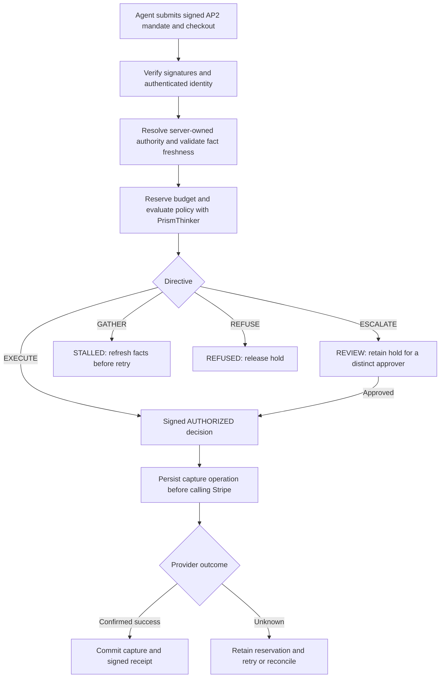

# PrismAgenticPay: Payment Authorization and Spend Controls for AI Agents

**Give AI agents a defined spending authority, an approval workflow, and a recoverable payment lifecycle.**

PrismAgenticPay is a Python policy-authority service for **agentic payments**. It verifies signed AP2 payment mandates, evaluates enterprise spending rules with PrismThinker, reserves budget, and issues signed authorization decisions before a supported payment provider can capture funds.

Built for teams developing autonomous purchasing agents, procurement workflows, and AI applications that need auditable control over spending.

**Author: Amin Parva** · **Version: 1.4.0** · **Python: 3.11+** · **License: MIT**

[Quick start](#quick-start) · [Architecture](#how-agent-payment-authorization-works) · [HTTP API](#http-api) · [Testing](#testing-and-validation) · [Deployment guide](docs/PRODUCTION.md)

## The problem: an agent can request a payment before it has the authority to spend

Connecting an AI agent to a payment API creates a gap between its ability to act and the business's permission to spend. A proposed purchase still needs answers to concrete questions:

- **Who authorized this purchase?** A model-generated request is not a verified payment mandate.
- **Is the budget still available?** Concurrent agents can compete for the same session, daily, or mandate allocation.
- **Are the business facts current?** Yesterday's vendor approval or an untracked authority assertion may be insufficient today.
- **Does this payment need a second approver?** An agent must not approve its own escalation by submitting another person's name.
- **What happened after a timeout?** Retrying a capture or refund without durable operation identity can create duplicate financial effects.
- **Can we explain the result after a restart?** Decisions, approvals, receipts, and payment references need to survive beyond a process's memory.

PrismAgenticPay places these checks between the agent's proposed purchase and payment execution.

## The solution: verify, authorize, reserve, and reconcile

The service turns a signed payment mandate and server-owned authority data into an explicit decision. The payment provider handles the funds; PrismAgenticPay controls the authorization and records the workflow around that movement.

### Verify the purchase and the caller

The production API verifies ES256 signatures for the payment mandate and merchant checkout, checks their hash binding, and resolves public keys from a purpose-scoped trust registry. The verified principal and agent must match the authenticated API identity.

Authority grants are loaded on the server. A purchasing client cannot supply its own approved vendor status or spending limits through the production authorization endpoint.

### Apply policy to fresh enterprise facts

PrismThinker evaluates corporate policy, and `to_chorusgraph()` supplies the execution directive. Source timestamps and TTLs determine whether facts can participate in the decision. Missing, stale, or future-dated metadata causes facts to be withheld.

Reference policies cover vendor standing, per-transaction limits, session budgets, principal-day budgets, mandate budgets, and dual approval. SAP, NetSuite, and Coupa HTTP adapters can supply vendor facts when configured; their field mappings require validation against the target tenant.

### Reserve spending capacity before execution

A multi-bucket ledger reserves budget for an eligible proposal. Human-review cases retain their holds, while gather cases release capacity for a later attempt with fresh facts. Payment hashes bind the amount, currency, merchant identity, category, line items, principal, agent, mandate identity and expiry, and nonce.

### Recover payments without guessing their outcome

Before contacting Stripe, the service persists a payment operation and marks its hold as processing. An unknown provider outcome keeps capacity reserved. Recovery reuses the original operation ID or checks provider evidence before updating balances.

Distinct refunds receive distinct operation IDs, even when their amounts match. Retrying the same logical refund reuses its ID. Partial-capture receipts report the amount actually captured.

## How agent payment authorization works



Authorization decisions are signed with Ed25519. Receipts use ES256. SQLite transactions persist holds, decisions, cases, audit events, policies, and payment operations together. Local connections reload state under the database writer lock to avoid overwriting another connection's changes.

## Example: an agent buys a software seat

The local integration scenario models a **$25 software purchase** that requires finance approval:

1. The server verifies the signed mandate and returns `REVIEW`.
2. A capture attempt is blocked, and the purchasing identity cannot impersonate the reviewer.
3. A distinct authenticated controller approves the purchase.
4. The merchant captures **$20**, and the service issues a signed receipt for that amount.
5. A **$5 refund** leaves **$15 net spend** in the ledger.
6. After the application restarts, refund replay, audit history, balances, and receipt verification remain consistent.

This scenario uses real HTTP, cryptographic signatures, PrismThinker, and SQLite with a simulated payment provider. A separate opt-in test exercises Stripe's actual sandbox API.

## Quick start

Clone the repository and create an isolated environment. Python 3.12 was used for the recorded validation.

```bash
git clone https://github.com/insightitsGit/prismagenticpay.git
cd prismagenticpay
python -m venv .venv
```

Activate the environment:

```bash
# macOS / Linux
source .venv/bin/activate
```

```powershell
# Windows PowerShell
.\.venv\Scripts\Activate.ps1
```

Install the tested dependencies and run the local suite:

```bash
python -m pip install -r requirements-tested.txt
python -m pip install --no-deps -e .
python -m pytest -q
```

Run the complete local HTTP purchase scenario:

```bash
python -m pytest tests/test_local_scenario.py -v
```

The scenario creates temporary registries, keys, a database, and loopback HTTP servers. It does not need company credentials or move money. See [local testing instructions](docs/LOCAL_TESTING.md) for sandboxed filesystem environments and the real Stripe sandbox test.

## Run the payment-authority service

Configure the server-owned registries, stable signing seed, durable database, and Stripe test credentials described in the [deployment guide](docs/PRODUCTION.md), then start the application:

```bash
uvicorn prismagenticpay.runtime:create_production_app --factory --host 127.0.0.1 --port 8080
```

Production configuration includes:

- `PAP_ENV=production`
- `PAP_SIGNING_SEED_HEX`
- `PAP_DATABASE_URL`
- `PAP_IDENTITY_REGISTRY_PATH`
- `PAP_AUTHORITY_REGISTRY_PATH`
- `PAP_TRUST_REGISTRY_PATH`
- `PAP_ALLOWED_RAILS=stripe`
- `STRIPE_API_KEY`

Keep secrets on the server. Use sandbox credentials for integration testing. The deployment guide includes registry formats, identity roles, recovery procedures, Docker Compose configuration, and upgrade requirements.

## HTTP API

The FastAPI service exposes these primary operations:

- `POST /v1/authorize/ap2` — verify a signed mandate and return an authorization decision.
- `POST /v1/reviews/{case_id}/approve` or `/deny` — resolve human review using the authenticated reviewer.
- `POST /v1/gathers/{case_id}/resume` — reload server facts and retry within the original session scope.
- `POST /v1/capture` — capture against a valid signed authorization.
- `POST /v1/refund` — submit a refund with a stable logical operation ID.
- `GET /v1/operations` — inspect durable payment-operation status.
- `POST /v1/operations/{operation_id}/retry` or `/reconcile` — recover an interrupted operation.
- `GET /v1/audit` — retrieve recorded workflow events.
- `/v1/policies` and `/v1/policies/simulate` — manage and evaluate policy rules.
- `GET /healthz`, `/readyz`, and `/console` — liveness, storage readiness, and the operator console.

Production uses named API identities with explicit roles. The raw `/v1/authorize` and `/v1/settle` routes are development harnesses and return `403` in production. Request schemas are available through FastAPI's `/docs` endpoint when the service is running.

## Testing and validation

The recorded local validation result is **93 passed, 1 skipped**. The skipped test requires an explicit Stripe sandbox opt-in and a test key.

Coverage includes authorization boundaries, budget contention, fact freshness, dual approval, signature tampering, partial capture, refund idempotency, SQLite concurrency, durable audit history, and restart recovery. Fault-injection tests cover a lost response after provider payment and a database failure after provider success.

Read the [implementation audit](docs/IMPLEMENTATION_AUDIT.md) for the evidence and remaining release checks. Passing local tests is not a certification of a company's provider account, ERP configuration, or deployed infrastructure.

## Supported scope and current limits

Version 1.4.0 supports a **single configured accounting currency with Stripe settlement**. Coinbase/ISO settlement and caller-supplied FX are disabled in the production runtime. Full SD-JWT-VC ecosystem interoperability and multi-region operation are outside the supported scope.

SQLite stores complete workflow snapshots, so write cost grows with history. Validate throughput, backups, recovery monitoring, TLS, identity provisioning, and ERP mappings for your deployment. Old unknown provider operations require reconciliation; automated retries stop after 23 hours.

Before enabling real-money traffic, complete the real Stripe sandbox test and deployment acceptance. Upgrading from 1.3 also requires reviewing the changed payment hashes, signature format, and API trust boundary.

## Documentation

- [Kernel specification](docs/KERNEL_SPEC.md)
- [System design](docs/SYSTEM_DESIGN.md)
- [Production configuration and recovery](docs/PRODUCTION.md)
- [Unit, local integration, and Stripe sandbox testing](docs/LOCAL_TESTING.md)
- [Implementation audit and remediation](docs/IMPLEMENTATION_AUDIT.md)
- [Company integration and return handoff](docs/COMPANY_STRIPE_HANDOFF.md)

## Author

**Amin Parva** — author of PrismAgenticPay.

PrismAgenticPay is licensed under the MIT license, as declared in its [package metadata](pyproject.toml).
